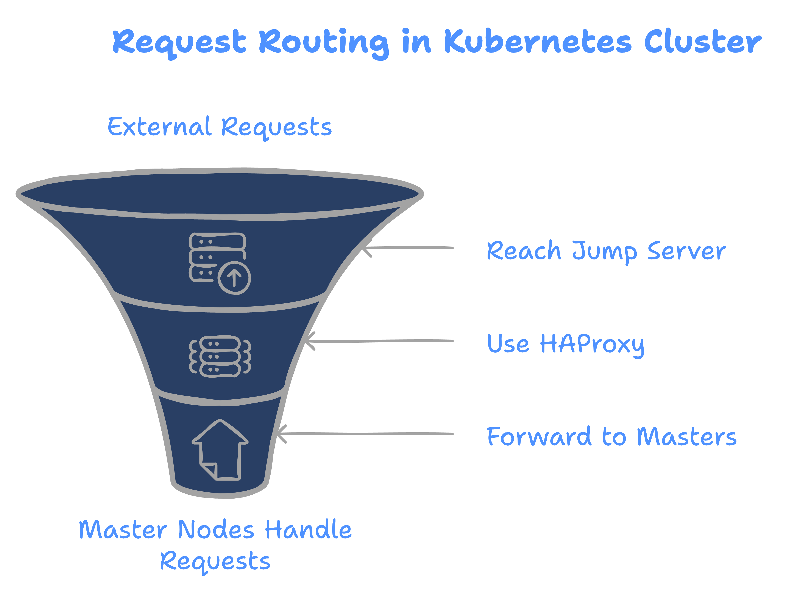
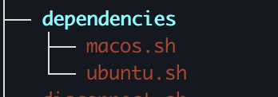
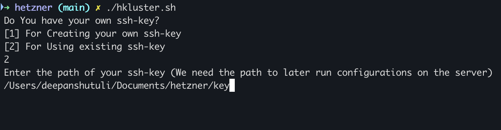
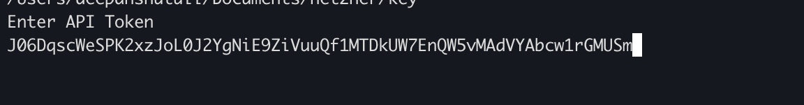
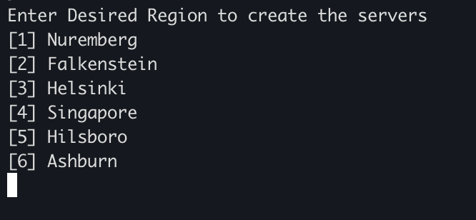
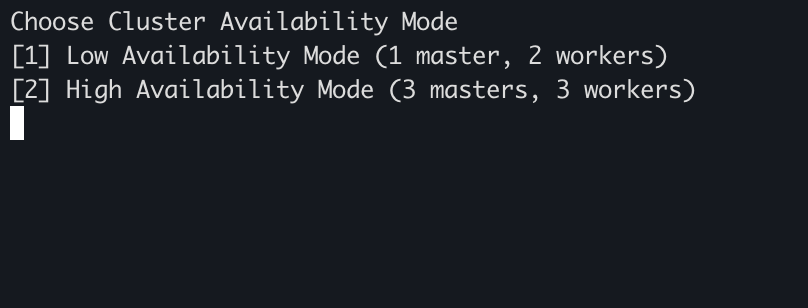
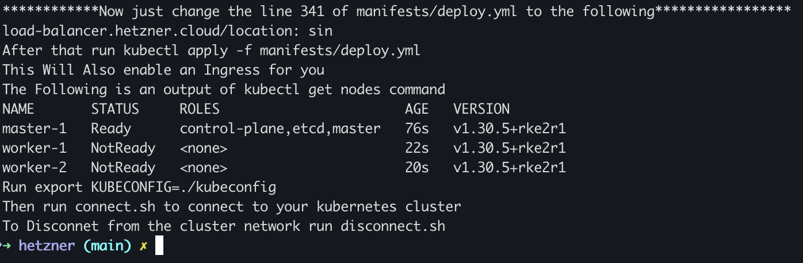
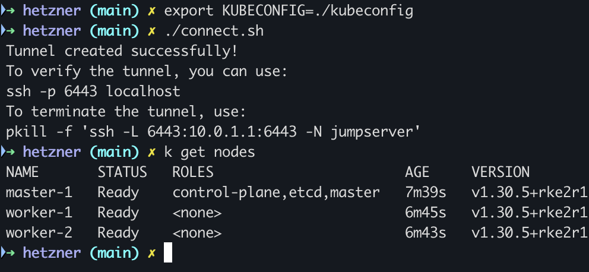
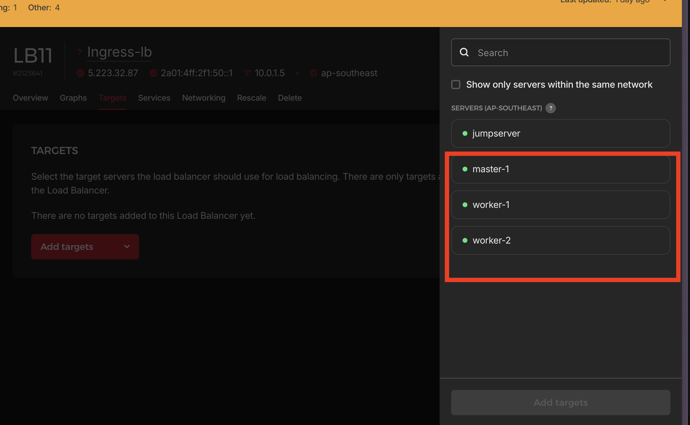

# Creating a Low/High Availaibility Kubernetes cluster on Hetzner cloud

## Table of Contents
- [About](#about)
- [Architecture](#architechture)
- [Getting Started](#getting-started)
- [Running the script](#running-the-script)
- [Post Completion Steps](#post-completion-steps)
- [Extra Files Generated](#files-generated)


## About
While working on an internal project I was required to switch the entire infrastructure of an application from Dokcer swarm to kubernetes. While setting up a kubernetes cluster has become very easy with managed services today, one cannot create a kubernetes cluster without breaking the bank. The only constraint was to do it using hetzner cloud. After finally achieving our required goal, I came to the realisation that creating a solution for provisioning the this cluster will make kubernetes deployments much cheaper
- **Hetzner Cloud**: Hetzner typically offers very competitive pricing for virtual machines and dedicated servers compared to major cloud providers. For example, a Hetzner Cloud instance with 4 vCPUs and 16 GB RAM costs around €19.92 (~₹1,750 or ~$21) per month.
- **Managed Services (GKE, EKS)**: Managed services generally have higher instance costs. A similar configuration on GCP or AWS can be 2x or 3x more expensive.

## Architechture 
Even though creating a kubernetes cluster has become very easy with tools like rancher, on hetzner it only works if your master and worker nodes are in public subnet and not private subnet. However with this script I have made the architecture in such a way that the master and worker nodes are in a private network and are only accessible through a bastion host called jumpserver. Even the requests which we send to interact with the kube-api server and as a result the kubenetes cluster are sent to the jumpserver which redirects those requests to the kube-api server using haproxy. My Script takes care of everything including these haproxy configurations. 

.png>)
*layout of basic infrastructure in **high availaibility**(3 master nodes,3 worker nodes) mode*

The basic flow of requests is also explained in the graphic below



## Getting Started
*First things first, since I have written this entire script in bash this support is limited to only linux and mac users. But we can resolve this issue using wsl in windows, full link can be found [here](https://learn.microsoft.com/en-us/windows/wsl/install) or if you prefer watching a video click [here](https://www.youtube.com/watch?v=vxTW22y8zV8&pp=ygUaaG93IHRvIHVzZSB3c2wgaW4gd2luZG93cyA%3D)*

Now I assume we are all either natively in command line or through wsl.

### Install Dependencies
Allthough not a lot of dependencies are required I have included a couple of sripts for either ubuntu or macOS in the repository itself


#### MacOS
For macos just install brew package manager if not already installed using the following command
```bash
/bin/bash -c "$(curl -fsSL https://raw.githubusercontent.com/Homebrew/install/HEAD/install.sh)"
```
After installing homebrew just run 
```
cd dependencies/
./macos.sh
```
#### Ubuntu
For linux since apt you can use 
```
cd dependencies/
./ubuntu.sh
```
However click on the respective links to download both 
- [Kubectl](https://kubernetes.io/docs/tasks/tools/install-kubectl-linux/)
- [Helm](https://helm.sh/docs/intro/install/)

***These are all mandatory for the script to run, however feel free to reachout to me if you face any troubles up until this point***

## Running the script
*Assuming that you have already cloned the repository and your current working directory is the repository*

Star the script by running 
```bash
./hkluster.sh
```
The script will take various inputs from you such as the following

### SSH-Key Input

[1] This option will ask you for the path of your current ssh-private key on your local system.

[2] This will create a new ssh-key for you in present working directory.

***This will not have any access to your ssh-key we are just taking the path to upload the corresponding public key to hetzner and we need the path to authenticate the connection to the nodes while the configuration stage of the script. Also make sure to input the full path if you are using your existing ssh-key and not relative path***

### Api-Token
The script will then proceed to ask you your hetzner api token, this is will be used to authenticate the connection to your hetzner cloud dashboard

*This token is expired so no funny business :P*

### Region Input


At the time of making of this video hetzner has 6 supported regions and I have added support for all of them.

### Availaibility Mode

This is the final input which the script will ask from the user.

After all the inputs following things will take place 
- Check for reachability of the servers to configure them
- Configure the newly deployed servers using ansible
- Install an additional helm chart to add better compatibility with hetzner. Read more about it [here](https://github.com/hetznercloud/hcloud-cloud-controller-manager) 

## Post Completion steps 
The script will give you a set of instructions to perform after the completion of its execution. They include instructions to connect with the cluster as well as an additional step if you want to enable ingress. Once you follow the steps it will create a loadbalancer on hetzner by the name "Ingress-LB" and then all you need to do is add your nodes as a target to that node balancer.



***If you wait for a couple of minutes and following the instructions to connect to your cluster you will see that the nodes are now in ready state***



***After this you will have a working ingress to expose your services.***

Execute the following commands in order to stop exporting kubeconfig before connecting to the cluster 

```bash
mkdir -p ~/.kube
mv ./kubeconfig ~/.kube/config
```
## Files Generated
After the execution of this script 
- **kubeconfig**: this is the kubecnfig file
- **node-token**: This is a unique identifier used to connect more nodes to the cluster, I will shortly add a tutorial on how to do that.
- **inventory.yaml**: An ansible inventory created along with arguements which allow to establish the connection with private nodes by using a connection with the jumpserver